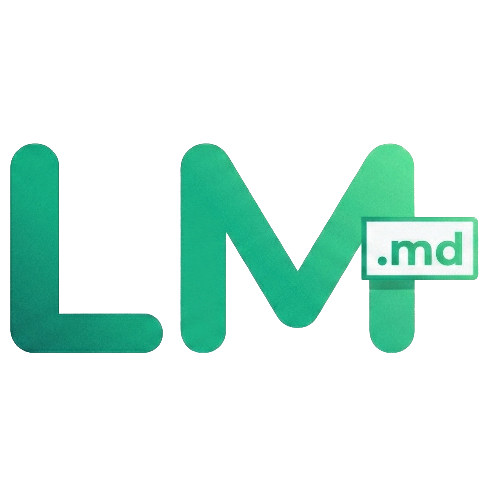

<div align="center">
  
</div>

# 📝 LiveMark Studio


**LiveMark Studio** es un editor Markdown moderno y ligero con vista previa en tiempo real, diseñado para ofrecer una experiencia de escritura fluida y productiva. Construido con React, Vite y Tailwind CSS.

---

## 👥 Autores

**Robert Rosario** - [GitHub Profile](https://github.com/rxbert07)  
**Christian Martinez** - [GitHub Profile](https://github.com/christian-zzz)  
**Josue Bauza** - [GitHub Profile](https://github.com/mbauza3533-maker)

---

## 🚀 Características Principales

### ✍️ Editor Markdown Completo
- **Vista previa en tiempo real**: Renderizado instantáneo de Markdown mientras escribes
- **Resaltado de sintaxis**: Soporte para múltiples lenguajes de programación con Highlight.js
- **Barra de herramientas visual**: Botones interactivos para formato rápido (negrita, cursiva, encabezados, listas, etc.)
- **Tooltips informativos**: Cada botón muestra su atajo de teclado correspondiente

### ⌨️ Atajos de Teclado
- `Ctrl+A`: Crear nueva nota
- `Ctrl+F`: Enfocar búsqueda
- `Ctrl+B`: Aplicar negrita
- `Ctrl+I`: Aplicar cursiva
- `Ctrl+K`: Insertar enlace
- `Ctrl+/`: Mostrar ayuda de atajos

### 🎨 Temas Personalizables
- **Modo claro/oscuro**: Cambia entre temas con un solo clic
- **Persistencia**: Tu preferencia de tema se guarda automáticamente
- **Animaciones suaves**: Transiciones fluidas entre temas

### 🔍 Búsqueda Inteligente
- **Búsqueda en tiempo real**: Filtra notas por título y contenido
- **Case-insensitive**: Encuentra resultados sin importar mayúsculas/minúsculas
- **Atajo rápido**: `Ctrl+F` para acceso instantáneo

### 💾 Gestión de Notas
- **Guardado automático**: Tus cambios se guardan en localStorage sin intervención manual
- **Drag & Drop para reordenar**: Arrastra notas para organizarlas a tu gusto
- **Selección múltiple**: Elimina varias notas a la vez
- **Importar archivos**: Arrastra archivos `.md`, `.txt` o `.markdown` para crear notas

### 📤 Exportación Flexible
- **Markdown (.md)**: Formato nativo
- **Texto plano (.txt)**: Sin formato
- **HTML (.html)**: Documento web completo
- **PDF (.pdf)**: Documento listo para imprimir

### 🎯 Características Adicionales
- **Soporte multimedia**: Inserta imágenes, videos y audio en tus notas
- **Contador de palabras y caracteres**: Estadísticas en tiempo real
- **Interfaz responsive**: Diseño adaptable a diferentes tamaños de pantalla
- **Sin dependencias de backend**: Funciona completamente en el navegador

---

## 📋 Requisitos Previos

Para ejecutar este proyecto localmente, necesitas:

- **Node.js** (versión 16 o superior)
- **npm** o **yarn**
- Un navegador web moderno (Chrome, Firefox, Edge, Safari)

---

## 🛠️ Guía de Instalación

Sigue estos pasos para configurar el entorno de desarrollo:

### 1. Clonar el Repositorio

```bash
git clone https://github.com/rxbert07/LiveMark-Studio.git
cd LiveMark-Studio
```

### 2. Instalar Dependencias

```bash
npm install
```

### 3. Iniciar el Servidor de Desarrollo

```bash
npm run dev
```

✅ **¡Listo!** La aplicación estará disponible en: **http://localhost:5173**

---

## 📦 Scripts Disponibles

| Comando | Descripción |
|---------|-------------|
| `npm run dev` | Inicia el servidor de desarrollo con hot-reload |
| `npm run build` | Genera la versión de producción optimizada |
| `npm run preview` | Previsualiza la build de producción localmente |
| `npm run lint` | Ejecuta ESLint para verificar el código |

---

## 🎯 Uso de la Aplicación

### Crear una Nueva Nota
1. Haz clic en el botón **"+ Nueva nota"** en la barra lateral
2. O usa el atajo `Ctrl+A`

### Editar una Nota
1. Selecciona la nota de la lista lateral
2. Escribe en el editor usando sintaxis Markdown
3. Los cambios se guardan automáticamente

### Formatear Texto
**Opción 1: Barra de herramientas**
- Selecciona el texto y haz clic en el botón de formato deseado

**Opción 2: Atajos de teclado**
- `Ctrl+B`: **Negrita**
- `Ctrl+I`: *Cursiva*
- `Ctrl+K`: [Enlace](url)

**Opción 3: Sintaxis Markdown manual**
```markdown
# Encabezado 1
## Encabezado 2
**Negrita**
*Cursiva*
`código`
- Lista
> Cita
[Enlace](https://ejemplo.com)

```

### Buscar Notas
1. Haz clic en el campo de búsqueda o presiona `Ctrl+F`
2. Escribe tu consulta
3. Los resultados se filtran automáticamente

### Exportar una Nota
1. Selecciona la nota que deseas exportar
2. Haz clic en el botón de descarga (⬇️) en el encabezado del editor
3. Elige el formato: TXT, MD, HTML o PDF

### Importar Archivos
**Opción 1: Botón "Abrir"**
- Haz clic en "Abrir" y selecciona un archivo

**Opción 2: Drag & Drop**
- Arrastra un archivo `.md`, `.txt` o `.markdown` desde tu explorador de archivos
- Suéltalo en cualquier parte de la ventana

### Reordenar Notas
- Arrastra una nota de la lista y suéltala en la posición deseada

### Eliminar Notas
**Eliminar una nota:**
- Pasa el cursor sobre la nota y haz clic en el botón rojo (X)

**Eliminar múltiples notas:**
1. Haz clic en "Seleccionar"
2. Marca las notas que deseas eliminar
3. Haz clic en "Eliminar" en la barra inferior

---

## 🏗️ Estructura del Proyecto

```
livemark-studio/
├── public/              # Archivos estáticos
├── src/
│   ├── components/      # Componentes React
│   │   ├── DragOverlay.jsx        # Overlay para arrastrar y soltar
│   │   ├── Editor.jsx             # Editor de texto Markdown
│   │   ├── Header.jsx             # Encabezado de la aplicación
│   │   ├── MarkdownToolbar.jsx    # Barra de herramientas de formato
│   │   ├── Modal.jsx              # Componente modal reutilizable
│   │   ├── Preview.jsx            # Vista previa del Markdown renderizado
│   │   ├── ShortcutsModal.jsx     # Modal de atajos de teclado
│   │   ├── Sidebar.jsx            # Barra lateral con lista de notas
│   │   └── ThemeToggle.jsx        # Toggle de tema claro/oscuro
│   ├── hooks/           # Custom hooks
│   │   ├── useDragDrop.js         # Lógica de arrastrar y soltar
│   │   ├── useHistory.js          # Historial de cambios (undo/redo)
│   │   ├── useKeyboardShortcuts.js # Hook de atajos de teclado
│   │   ├── useNotes.js            # Gestión del estado de las notas
│   │   └── useTheme.js            # Gestión del tema (claro/oscuro)
│   ├── App.jsx          # Componente principal
│   ├── main.jsx         # Punto de entrada
│   └── index.css        # Estilos globales
├── .gitignore
├── package.json
├── vite.config.js       # Configuración de Vite
├── tailwind.config.cjs  # Configuración de Tailwind
└── README.md
```

---

## 🔧 Tecnologías Utilizadas

| Tecnología | Versión | Propósito |
|------------|---------|-----------|
| **React** | 18.3.1 | Librería UI |
| **Vite** | 7.2.4 | Build tool y dev server |
| **Tailwind CSS** | 3.4.17 | Framework CSS utility-first |
| **Markdown-it** | 14.1.0 | Parser de Markdown |
| **Highlight.js** | 11.11.1 | Resaltado de sintaxis |
| **html2pdf.js** | 0.10.2 | Exportación a PDF |
| **nanoid** | 5.0.9 | Generación de IDs únicos |

---

## 🎨 Personalización

### Cambiar el Tema por Defecto
Edita `src/App.jsx` línea 116-122:

```javascript
const [theme, setTheme] = useState(() => {
  const savedTheme = localStorage.getItem('livemark-theme');
  if (savedTheme) return savedTheme;
  // Cambia 'dark' por 'light' para tema claro por defecto
  return window.matchMedia('(prefers-color-scheme: dark)').matches ? 'dark' : 'light';
});
```

### Agregar Nuevos Botones a la Toolbar
Edita `src/components/MarkdownToolbar.jsx` y agrega tu botón personalizado:

```jsx
<ToolbarButton onClick={() => insertText('~~', '~~')} title="Tachado" theme={theme}>
  <StrikeIcon />
</ToolbarButton>
```

---

## 📄 Licencia

Este proyecto está licenciado bajo la **Licencia MIT**.

---

## 🤝 Contribuciones

Las contribuciones son bienvenidas. Si deseas mejorar LiveMark Studio:

1. Haz un fork del proyecto
2. Crea una rama para tu feature (`git checkout -b feature/AmazingFeature`)
3. Commit tus cambios (`git commit -m 'Add some AmazingFeature'`)
4. Push a la rama (`git push origin feature/AmazingFeature`)
5. Abre un Pull Request

Consulta nuestra [Guía de Contribución](CONTRIBUTING.md) para más detalles.

---

## 📞 Contacto

¿Tienes preguntas o sugerencias? Abre un [issue](https://github.com/rxbert07/LiveMark-Studio/issues) en GitHub.

---

<div align="center">
  Hecho con ❤️ por <a href="https://github.com/rxbert07">Robert Rosario</a>, <a href="https://github.com/christian-zzz">Christian Martinez</a> y <a href="https://github.com/mbauza3533-maker">Josue Bauza</a>
</div>
